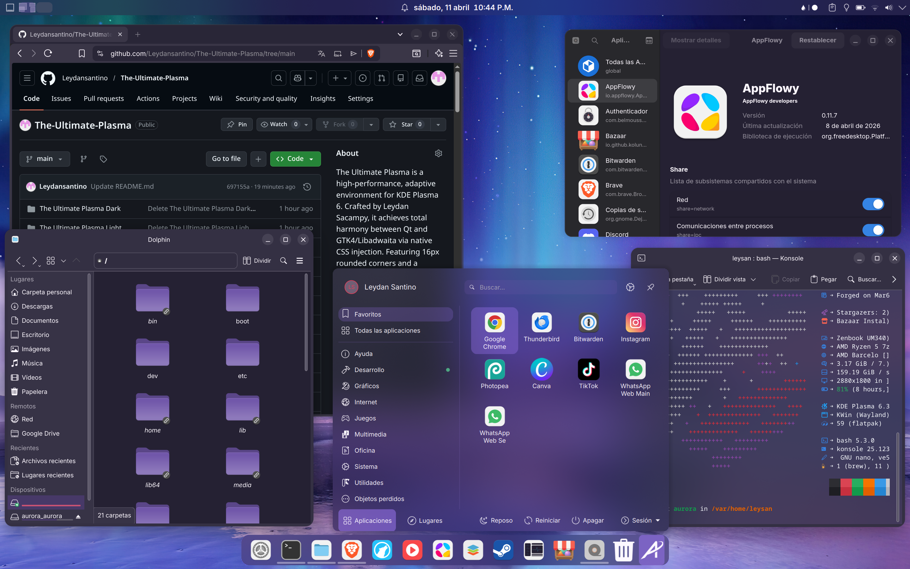
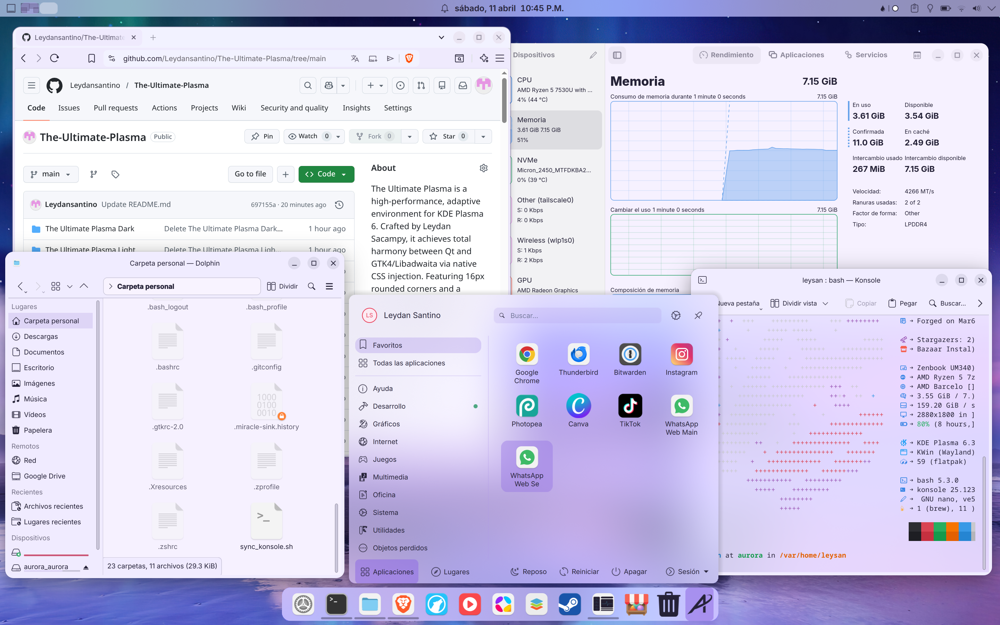
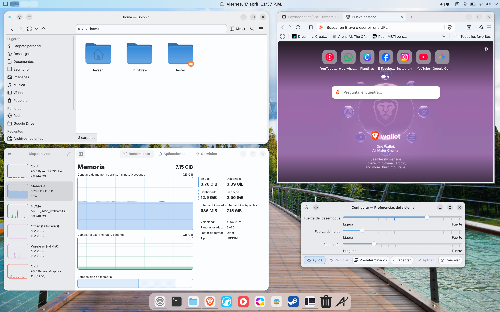
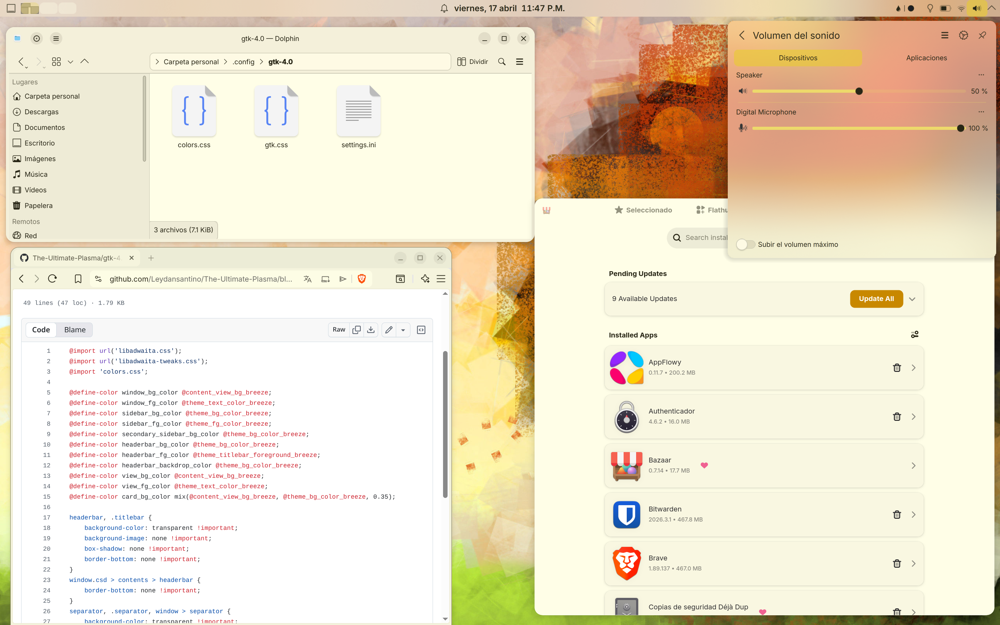

# The Ultimate Plasma
 
A complete theme for KDE Plasma that unifies the look of Qt, GTK3, GTK4, and Libadwaita applications under a single visual language. Uses Klassy for window decorations and application style, ensuring consistent button icons across all apps — including GNOME and Chromium-based browsers.
 
**Compatible with Aurora & Bazzite & Fedora Kinoite — Plasma 6.6**


## 🔒 System Integrity First

The Ultimate Plasma does NOT modify your system.

- No changes to /usr
- No rpm-ostree overrides
- No global package installation
- Fully contained in user space (/home)
- Built with an atomic-first mindset, fully compatible with immutable systems like Fedora Kinoite.


## 📸 Screenshots

### Dark Mode



### Light Mode




> [!NOTE]
> When a GTK4/Libadwaita window loses focus, the left sidebar may revert to a neutral grey tone instead of keeping the active color tint. This is a known Libadwaita limitation — the backdrop state is handled internally in C code and cannot be overridden via `gtk.css`. It does not affect functionality and is subtle enough to be considered acceptable behavior.

---

## 🎨 How It Works — One Source of Truth

Unlike traditional themes that hardcode colors, The Ultimate Plasma is fully adaptive. The KDE Plasma color scheme acts as a single source of truth: every time you switch accent color or change between light and dark mode in System Settings, Qt apps, GTK3, GTK4/Libadwaita apps, and Chromium-based browsers all update automatically — no manual intervention needed. This is achieved by injecting Breeze color scheme variables directly into `gtk.css`, bridging the gap between the Qt and GTK worlds natively.

---
 
## What's included
 
- **Klassy** — window decorations and Qt application style (consistent button icons everywhere)
- **GTK 3 & GTK 4 / Libadwaita** — GNOME apps and Chromium follow the system color scheme
- **Plasma Desktop Theme** — panel, widgets, and system tray styling
- **Look and Feel** — dark and light global themes ready to switch between
- **Color schemes** — `TheUltimatePlasmaDark` and `TheUltimatePlasmaLight`
- **Inter font** — variable font used as the system-wide typeface
- **Adaptive Konsole** — terminal automatically picks background and foreground colors from the active theme on login
 
---
 
## Installation
 
> [!IMPORTANT]
> **Klassy must be installed before running the main installer.** The theme depends on Klassy for window decorations and application style. Skip this step and nothing will look right.
 
### Step 1 — Install Klassy
 
(requires [Distrobox](https://distrobox.it)):
 
```bash
git clone https://github.com/Leydansantino/The-Ultimate-Plasma
cd The-Ultimate-Plasma/klassy
chmod +x install-from-source.sh
./install-from-source.sh
```
 
See [klassy/README.md](klassy/README.md) for full details on both options.
 
### Step 2 — Install the theme
 
```bash
cd
cd The-Ultimate-Plasma
chmod +x install.sh
./install.sh
```
 
Log out and back in to apply all changes.
 
---
 
## Applying the theme
 
After logging back in:
 
1. **System Settings → Global Theme** → choose `The Ultimate Plasma Dark` or `The Ultimate Plasma Light`
   > Always apply from this screen first, not from Quick Settings
2. **System Settings → Window Decorations** → select `Klassy`
3. **System Settings → Application Style** → select `Klassy`
 
If you want the GNOME/MacOS type layout, you can modify it in the panel settings on the desktop.

---

## Final Polishing & Fixes

> **How it works:** The `gtk.css` file injects KDE Plasma's Breeze color variables directly into the browser via GTK3. This means the tab bar, toolbar, and address bar automatically follow your active light or dark color scheme — including accent color changes — without any browser extension or manual configuration.

### 🌐 Chromium-based Browsers (Chrome, Brave, Edge)
To ensure your browser matches the system's aesthetic and follows the light/dark mode adaptive colors:

1. Open your browser **Settings**.
2. Navigate to **Appearance** (or Design).
3. Look for the **"Use GTK"** (or "System theme") button and activate it.
   * *This allows the browser to inherit the global CSS injection from the theme.*


### 🛠️ GTK App Icon Mismatch (Buttons Fix)
If the window control icons (Minimize, Maximize, Close) in GTK apps don't perfectly match the Plasma/Klassy style:

1. Go to **System Settings** → **Window Decorations**.
2. Select **Klassy** and click the **Edit** (pencil icon).
3. In the settings window, navigate to the **Buttons** tab.
4. Briefly change the **Button Icon Style** to a different one (e.g., "Klassy") and then switch it back to **"Traditional"** (or your preferred style).
   * *This force-refreshes the icon cache for GTK applications and synchronizes the visual language across all windows.*


### 🔡 Set Inter as System Font

The script installs the **Inter Variable** font files, but you need to manually tell Plasma to use them. For the best "Industrial/Apple" look, follow these steps:

1. Open **System Settings** → **Font Management**.
2. Click on **Fonts** (Adjust All Fonts...).
3. Change all main categories to **Inter Variable**:
   - **General:** Inter Variable (Regular) - 10pt
   - **Fixed width:** Inter Variable (Medium) - 10pt
   - **Small:** Inter Variable (Regular) - 8pt
   - **Toolbar/Menu/Window Title:** Inter Variable (Medium) - 10pt
4. **Important:** Set **Font Rendering** to *Enabled* with *RGB Anti-aliasing* and *Slight Hinting* for maximum crispness.
5. Click **Apply**.


### 🎨 Recommended: Colloid Icon Theme
 
To achieve the full aesthetic, install the **Colloid** icon theme — no terminal needed:
 
1. Open **System Settings → Icons**
2. Click **Get New Icons...** at the bottom
3. Search for **Colloid** and install your preferred variant (e.g. Colloid-purple)
 
Then configure Klassy to use it:
 
4. Open **System Settings → Window Decorations** → click the pencil icon next to Klassy
5. Go to **System Icon Generation** and set:
   - **Klassy icon theme inherits** → `Colloid-Light`
   - **Klassy Dark icon theme inherits** → `Colloid-Dark`
6. Click **Generate System Icons** and apply
7. Return to icons, change any icon pack, and return again to the Klassy icon pack to load correctly
 
---
 
## Adaptive Konsole
 
`sync_konsole.sh` reads the active Plasma theme colors and injects them into the `Adaptive-Plasma` Konsole profile. It runs automatically on login via autostart.
 
If you switch between dark and light during a session, run it manually:
 
```bash
~/.local/bin/sync_konsole.sh
```
 
## Installing Klassy standalone
 
If you only want Klassy without the full theme, see the [klassy/README.md](klassy/README.md).

---
 
## Uninstall
 
```bash
cd
cd The-Ultimate-Plasma
chmod +x uninstall.sh
./uninstall.sh
```
 
The Inter font will not be removed. The desktop layout config will be backed up, not deleted.
 
---
 
## Repository structure
 
```
The-Ultimate-Plasma/
├── install.sh
├── uninstall.sh
├── README.md
├── Inter-VariableFont_opsz,wght.ttf
├── Inter-Italic-VariableFont_opsz,wght.ttf
├── TheUltimatePlasmaDark.colors
├── TheUltimatePlasmaLight.colors
├── Adaptive-Plasma.colorscheme
├── klassyrc
├── plasma-org.kde.plasma.desktop-appletsrc
├── sync_konsole.sh
├── klassy/                          ← Klassy prebuilt binaries
├── The-Ultimate-Plasma/             ← Plasma Desktop Theme
├── The Ultimate Plasma Dark/        ← Dark Look and Feel
├── The Ultimate Plasma Light/       ← Light Look and Feel
├── gtk-3.0/
│   └── gtk.css
└── gtk-4.0/
    └── gtk.css
```
 
---

## 🧬 The Hybrid Plasma Theme — Utterly-Sonoma

The included Plasma Desktop Theme is a handcrafted hybrid between two themes:

- **Utterly Round** by HimDek — provides the visual language: 16px rounded corners, adaptive translucent blur, and full color-scheme responsiveness
- **MacSonoma-Light** by Vince Liuice — provides the structural logic: correct light/dark mode handling, lock screen and logout dialog contrast

Neither theme alone achieved the goal. Utterly Round lacks proper light mode support for system dialogs. MacSonoma has the correct logic but fixed white colors. The hybrid takes the SVG assets from Utterly Round and the semantic structure from MacSonoma, with the `solid/` folder removed to allow full color tinting.

---

## 🧭 The Story Behind This Project

This theme was born from a real journey. It started with a bold move: abandoning Windows 11 entirely for Linux. The road went through Fedora Workstation, Debian, CachyOS, Linux Mint, Zorin OS, Bazzite, Bluefin, and back — always chasing one thing: a visually coherent system that actually works.

GNOME was never the answer. No matter how polished it looks, Qt apps refuse to follow along — and on a 14-inch 2.8K OLED Zenbook that supports HDR and color profiles, every inconsistency is visible. Plasma was the right foundation, but early attempts with themes like Sweet required rpm-ostree overrides, broke GTK apps, left browsers half-styled, and introduced lag in window animations through slow Aurorae decorations.

The breakthrough came from combining three things nobody had put together before: Klassy for native, lag-free window decorations with consistent button icons across Qt and GTK; a gtk.css bridge that makes Breeze color variables the single source of truth for GTK3, GTK4/Libadwaita, and Chromium; and a hybrid Plasma theme that takes the visual language of Utterly Round and the structural correctness of MacSonoma.

The result is The Ultimate Plasma — the most ambitious personal theming project ever built for KDE Plasma 6 on immutable systems.

---

## Credits

- [Klassy](https://github.com/paulmcauley/klassy) by Paul McAuley
- Fuente [Inter](https://rsms.me/inter/) by Rasmus Andersson
- Utterly Round (https://github.com/HimDek/Utterly-Round-Plasma-Style/tree/master/desktoptheme) by HimDek
- MacSonoma-Light (https://github.com/vinceliuice/MacSonoma-kde/tree/main/plasma/desktoptheme/MacSonoma-Light) by Vince Liuice
