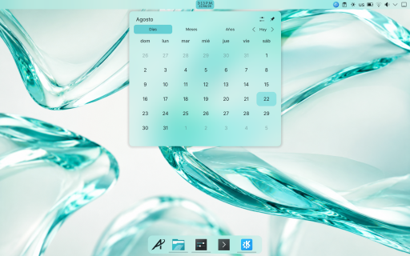
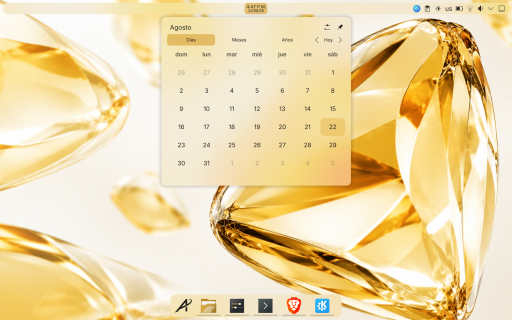
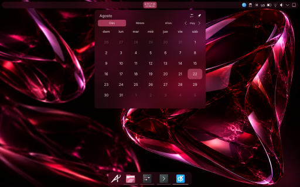
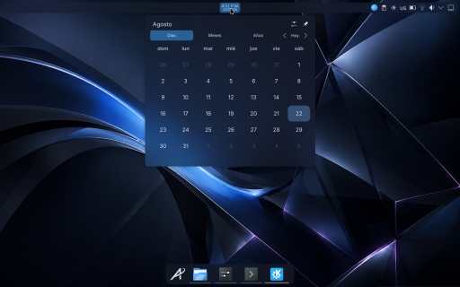
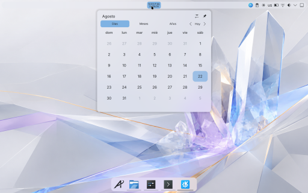
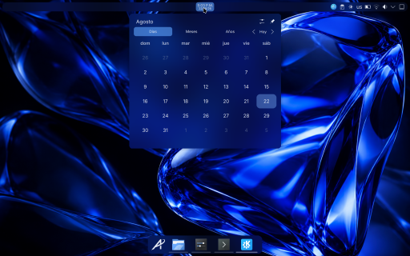
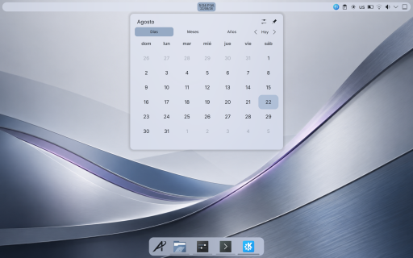

# The Ultimate Plasma

A complete theme for KDE Plasma that unifies the look of Qt, GTK3, GTK4, and Libadwaita applications under a single visual language. Uses Klassy for window decorations and application style, ensuring consistent button icons across all apps — including GNOME and Chromium-based browsers.

**Compatible with Aurora, Bazzite, and Fedora Kinoite — Plasma 6.6+**

---

## 🔒 System Integrity First

The Ultimate Plasma does NOT modify your system.

- No changes to `/usr`
- No `rpm-ostree` overrides
- No global package installation
- Fully contained in user space (`$HOME`)
- Built with an atomic-first mindset
- Designed for immutable KDE systems such as Aurora, Bazzite, and Fedora Kinoite

---

## 📸 Look-and-Feel Variants

The Ultimate Plasma includes seven Global Theme variants.

Each variant provides its own visual identity while keeping the same TUP design language, Klassy integration, Plasma Desktop Theme, wallpaper, and macOS-inspired desktop layout.

### Aquamarine



### Citrine



### Garnet



### Obsidian Blue



### Quarzo



### Sapphire



### Steel



> [!NOTE]
> The previews above are stored directly inside each Plasma Look-and-Feel package, so what you see represents the corresponding theme itself rather than a separate promotional screenshot.

---

## 🖥️ macOS-Inspired Plasma Layout

The TUP Look-and-Feel variants include a minimal desktop layout created natively through KDE Plasma.

The layout uses only standard Plasma widgets to avoid dependencies on third-party plasmoids.

It includes:

- A full-width top panel
- Global Menu
- Centered clock
- System Tray
- Show Desktop control
- A centered floating bottom dock
- Application Launcher
- Virtual Desktop Pager
- Icons-Only Task Manager
- Dolphin, System Settings, and Konsole launchers

The layout is intentionally minimal so it can be restored reliably on a normal Plasma installation without requiring extra widgets.

Each Global Theme also carries its own wallpaper and restores it together with the desktop layout.

---

## 🎨 How It Works — One Source of Truth

Unlike traditional themes that hardcode colors, The Ultimate Plasma is designed around the KDE Plasma color scheme as the primary source of truth.

Qt applications use the Plasma palette directly, while GTK3 and GTK4/Libadwaita applications receive KDE/Breeze-derived colors through the TUP CSS integration.

This allows the desktop, native KDE applications, GNOME applications, browsers, terminal, window decorations, and Plasma components to share the same visual language.

> [!NOTE]
> When a GTK4/Libadwaita window loses focus, the left sidebar may revert to a neutral grey tone instead of keeping the active color tint. This is a known Libadwaita limitation — the backdrop state is handled internally and cannot always be overridden through `gtk.css`. It does not affect functionality.

---

## What's Included

- **Klassy** — native window decorations and Qt application style
- **GTK 3 & GTK 4 / Libadwaita integration** — adapts GNOME applications to the KDE visual language
- **Plasma Desktop Theme** — panels, widgets, system tray, dialogs, and other Plasma components
- **Seven Look-and-Feel variants**
  - Aquamarine
  - Citrine
  - Garnet
  - Obsidian Blue
  - Quarzo
  - Sapphire
  - Steel
- **Per-theme wallpapers**
- **Per-theme preview artwork**
- **macOS-inspired Plasma desktop layout**
- **KDE color-scheme integration**
- **Inter font** — variable font used throughout the visual design
- **Adaptive Konsole** — terminal colors follow the active Plasma palette
- **Firefox / Waterfox CSS integration**
- **Chromium GTK integration**

---

## Installation

> [!IMPORTANT]
> **Klassy must be installed before running the main installer.**
>
> The Ultimate Plasma depends on Klassy for its native window decoration and Qt application style.

### Step 1 — Install Klassy

Requires [Distrobox](https://distrobox.it).

```bash
git clone https://github.com/Leydansantino/The-Ultimate-Plasma
cd The-Ultimate-Plasma/klassy
chmod +x install-from-source.sh
./install-from-source.sh
```

See [`klassy/README.md`](klassy/README.md) for full details on the available Klassy installation options.

### Step 2 — Install The Ultimate Plasma

```bash
cd
cd The-Ultimate-Plasma
chmod +x install.sh
./install.sh
```

Log out and back in after installation.

---

## Applying a Global Theme

After logging back in, open:

**System Settings → Colors & Themes → Global Theme**

Choose one of the seven TUP variants:

- **The Ultimate Plasma Aquamarine**
- **The Ultimate Plasma Citrine**
- **The Ultimate Plasma Garnet**
- **The Ultimate Plasma Obsidian Blue**
- **The Ultimate Plasma Quarzo**
- **The Ultimate Plasma Sapphire**
- **The Ultimate Plasma Steel**

Apply the theme from the Global Theme page.

Each TUP Global Theme is designed to apply its corresponding:

- KDE color configuration
- Klassy application style
- Klassy window decoration
- Plasma Desktop Theme
- Wallpaper
- macOS-inspired Plasma layout

The desktop layout does not require third-party plasmoids.

---

## Final Polishing & Fixes

### 🌐 Chromium-based Browsers

Chromium-based browsers can integrate with the GTK side of The Ultimate Plasma.

For Chrome, Chromium, Brave, Edge, and similar browsers:

1. Open browser **Settings**
2. Navigate to **Appearance**
3. Enable **Use GTK** or **System theme**, depending on the browser

This allows Chromium to inherit the GTK color integration provided by TUP.

---

## 🌐 Firefox and Waterfox

The repository also contains browser-specific CSS integration for Firefox-family browsers.

The generated browser colors translate KDE Plasma/Breeze concepts into variables that Gecko can consume for areas such as:

- Tab bar
- Active and inactive tabs
- Toolbar
- URL bar
- Borders
- Foreground colors

Browser-specific CSS is kept separate because Firefox-family browsers do not draw every interface component in the same way as Chromium or native GTK applications.

See:

```text
Firefox's browsers CSS/
```

for the corresponding Firefox and Waterfox files.

---

## 🛠️ GTK App Icon Mismatch

If window control icons in GTK applications do not perfectly match the Plasma/Klassy style:

1. Open **System Settings → Window Decorations**
2. Select **Klassy**
3. Click the edit/pencil button
4. Open the **Buttons** section
5. Temporarily select another button icon style
6. Switch back to your preferred style

This can force Klassy to regenerate or refresh the corresponding icon integration.

---

## 🔡 Set Inter as System Font

The installer includes the **Inter Variable** font files.

For the intended TUP typography:

1. Open **System Settings → Text & Fonts → Fonts**
2. Adjust the Plasma font categories
3. Use **Inter Variable** where appropriate

Recommended starting point:

- **General:** Inter Variable Regular — 10pt
- **Fixed width:** Inter Variable Medium — 10pt
- **Small:** Inter Variable Regular — 8pt
- **Toolbar:** Inter Variable Medium — 10pt
- **Menu:** Inter Variable Medium — 10pt
- **Window title:** Inter Variable Medium — 10pt

Font sizing may need adjustment depending on display size, scaling, and DPI.

---

## 🎨 Recommended: Colloid Icon Theme

To complement the TUP visual style, the **Colloid** icon family is recommended.

Installation can be done directly through KDE:

1. Open **System Settings → Icons**
2. Click **Get New Icons...**
3. Search for **Colloid**
4. Install your preferred variant

Klassy can also generate system icon variants based on an installed icon theme.

Open:

**System Settings → Window Decorations → Klassy → System Icon Generation**

and configure the desired light and dark icon inheritance.

---

## Adaptive Konsole

`sync_konsole.sh` reads the active Plasma theme colors and injects them into the `Adaptive-Plasma` Konsole color scheme.

It runs automatically on login through autostart.

If you change themes during an active session and want to refresh Konsole manually:

```bash
~/.local/bin/sync_konsole.sh
```

---

## Installing Klassy Standalone

If you only want Klassy without the full The Ultimate Plasma environment, see:

[`klassy/README.md`](klassy/README.md)

---

## Uninstall

Run:

```bash
cd
cd The-Ultimate-Plasma
chmod +x uninstall.sh
./uninstall.sh
```

The uninstall script is responsible for removing TUP-managed resources and handling configuration owned by the project.

---

## Repository Structure

```text
The-Ultimate-Plasma/
├── install.sh
├── uninstall.sh
├── README.md
├── LICENSE
│
├── Inter-VariableFont_opsz,wght.ttf
├── Inter-Italic-VariableFont_opsz,wght.ttf
│
├── Adaptive-Plasma.colorscheme
├── TheUltimatePlasmaAquamarineLight.colors
├── TheUltimatePlasmaCitrineLight.colors
├── TheUltimatePlasmaGarnet.colors
├── TheUltimatePlasmaObsidianBlue.colors
├── TheUltimatePlasmaQuarzo.colors
├── TheUltimatePlasmaSapphire.colors
├── TheUltimatePlasmaSteel.colors│
├── klassyrc
├── plasma-org.kde.plasma.desktop-appletsrc
├── sync_konsole.sh
│
├── klassy/
│
├── The-Ultimate-Plasma/              ← Plasma Desktop Theme
│
├── TUP-Aquamarine/                   ← Aquamarine Global Theme
│   ├── metadata.json
│   └── contents/
│       ├── defaults
│       ├── layouts/
│       ├── previews/
│       └── wallpapers/
│
├── TUP-Citrine/                      ← Citrine Global Theme
├── TUP-Garnet/                       ← Garnet Global Theme
├── TUP-Obsidian-Blue/                ← Obsidian Blue Global Theme
├── TUP-Quarzo/                       ← Quarzo Global Theme
├── TUP-Sapphire/                     ← Sapphire Global Theme
├── TUP-Steel/                        ← Steel Global Theme
│
├── Firefox's browsers CSS/
│
├── gtk-3.0/
│   └── gtk.css
│
└── gtk-4.0/
    └── gtk.css
```

Each `TUP-*` Look-and-Feel package contains the resources associated with that Global Theme, including its defaults, Plasma layout, preview artwork, and wallpaper.

---

## 🧬 The Hybrid Plasma Theme — Utterly-Sonoma

The included Plasma Desktop Theme is a handcrafted hybrid between two themes:

- **Utterly Round** by HimDek — provides the visual language: rounded corners, adaptive translucent elements, and color-scheme responsiveness
- **MacSonoma-Light** by Vince Liuice — provides structural logic for light/dark handling and Plasma system dialogs

Neither theme alone provided exactly the intended result.

Utterly Round provided much of the visual language, while MacSonoma provided useful structural behavior for Plasma components.

The Ultimate Plasma combines those ideas and adapts the resulting assets to its own color-driven desktop environment.

---

## 🧭 The Story Behind This Project

The Ultimate Plasma began as an attempt to create a Linux desktop where applications from different toolkits could coexist without looking like they belonged to completely different operating systems.

KDE Plasma provides the foundation because of its flexibility, native Qt integration, display capabilities, and highly configurable desktop shell.

The difficult part was everything around it.

GTK applications, Libadwaita, Chromium, Firefox-family browsers, window decorations, terminal colors, and Plasma widgets all interpret visual configuration differently.

The project gradually evolved into a collection of integrations designed around a common goal:

**make the KDE Plasma color system the center of the desktop's visual language.**

Klassy provides native Qt application styling and window decorations.

GTK CSS bridges KDE/Breeze colors into GTK3 and GTK4 applications.

Browser-specific integrations translate those concepts where normal GTK inheritance is not enough.

Adaptive Konsole carries the active palette into the terminal.

The Plasma Desktop Theme provides the shell-level visual language.

And the seven TUP Global Themes package those pieces into complete visual variants with their own wallpapers, previews, and desktop layouts.

The result is **The Ultimate Plasma**: a cohesive Plasma 6 environment designed with immutable Linux systems in mind.

---

## Credits

- [Klassy](https://github.com/paulmcauley/klassy) by Paul McAuley
- [Inter](https://rsms.me/inter/) by Rasmus Andersson
- [Utterly Round](https://github.com/HimDek/Utterly-Round-Plasma-Style/tree/master/desktoptheme) by HimDek
- [MacSonoma-Light](https://github.com/vinceliuice/MacSonoma-kde/tree/main/plasma/desktoptheme/MacSonoma-Light) by Vince Liuice
